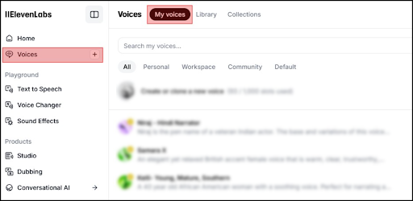
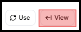
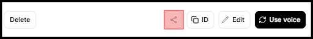

# How To Share ElevenLabs with PortalisAI

## Requirements

- You must have, at least, a Creator Plan on Eleven Labs
- You must maintain sharing on your desired voice

## Steps

1. Go to **"My Voices"** and find the voice you want to share

   

2. Click **"View"** to open the detailed view of course

   

3. Click the sharing icon at the bottom of the detailed view to open the Voice Model Sharing options

   

4. Enable the sharing toggle to generate a sharing link

5. Add **<toddc@portalis.ai>** to the "Whitelist emails" section. This is crucial as it ensures that only specified accounts can access the voice (or leave it blank, but then anyone with the link should be able to add the voice, but I would recommend using the whitelist).

6. Send the sharing link to **<emmanuel@portalis.ai>**.

   a. Example Link: <https://elevenlabs.io/app/voice-lab/share/f87f057c2250691953ac2e6227859706764bd08c88a055a18c74261957885a51/zgqefOY5FPQ3bB7OZTVR>
