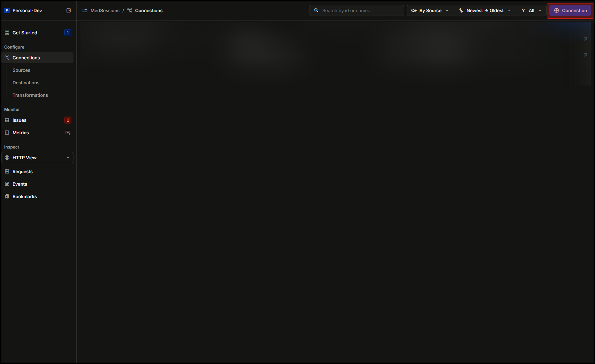
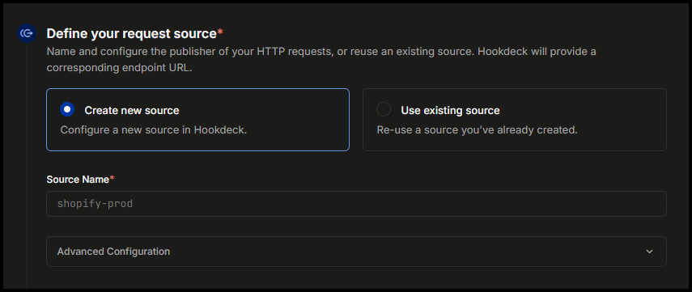
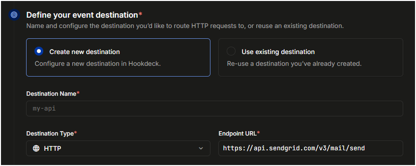

# Prerequisites

- Set up a Sendgrid account
- Set up a Hookdeck account

# Reference Documents

- [API Documentation - Portalis AI User Guide](https://docs.google.com/document/d/1WIUwAFbQvm1-OLuKTe_Ls_yEoa5GKKsrSwXxfqxY9os)
- [MILCode Usage - Portalis AI User Guide](https://docs.google.com/document/d/1zLEeJYEPaUspKWKBk2eDm6bTenE6CLopMBtddUj1QYk)

# Steps

## Setting Up the Prompt

Engineering our prompt will be the biggest hurdle we'll have to cross in regards to sending a recap email of the client's call with the avatar; but by following the practices below, it should be very straightforward to implement. Simply put, we will be designing the prompt in a manner where we are storing the variables (i.e. client email, name, subject, summary of visit, etc) and recalling them when sending our WEB_POST command(refer to API Documentation). Here are some guidelines to follow when creating the prompt for email sending

- Be clear and concise in the phrasing of your information gathering section of your prompt

  ```
   "Ask the user this question:
     'What is your preferred contact method? Please respond with either 'phone' or 'email' so I can update your preferences accordingly.'
     Upon the user's response, respond with the syntax correlating to their response:
     - [[SET|PreferredContact|Phone]]
     - [[SET|PreferredContact|Email]]"
  ```

- Use pseudo-variables to assist in the formatting of the avatar's expected response

  ```
   "Given the current summary of the conversation({{Summary}}), respond with this exact syntax to set the subject of the email, where <Subject> is a title created from the summary:

    [[SET|Subject|Client Intake Response: <Subject>]]"
  ```

  - In this example, we see that <Subject> is used as a stand-in when setting our actual variable as we are formatting the subject to start with "Client Intake Response:" This could be helpful if you're sending these intake forms to a high-traffic email, assisting in the organization of all responses.

- To send the WEB_POST for your email you will need to gather these base variables

  - Base variables
    - Client Email
    - Subject
    - Content
  - Rather than writing the entire body of the email here, you have the option to create a custom text or html template on Hookdeck for how you'd like the email to look like! To do this, I would recommend creating a new Content variable, [storing it as a json object](https://docs.google.com/document/d/1WIUwAFbQvm1-OLuKTe_Ls_yEoa5GKKsrSwXxfqxY9os/edit?tab=t.0#heading=h.gcfbowdbzlyz)
    ```
      [[SET|Content|@{{"name":{{Client Name}}, "preferred_contact": {{PreferredContact}}}}@]]
    ```

- Once you have gathered all relevant information, you will use the WEB_POST command to send a POST request to Hookdeck.
  ```
    [[WEB_POST|<https://hkdk.events/xxxxxxxxxxxxxx>|to={{Client Email}}|subject={{Subject}}|content={{Content}}]]
  ```

## Setting up Hookdeck

Hookdeck will be responsible for transforming the data we are passing from the WEB POST command from the avatar into the correct format for Sendgrid. This section will handle the aspect of creating the Connection, Transformations, and Destinations for Hookdeck.

1. From the **Dashboard**, select the **"Add Connection"** button.



2. Select **Create new source** and add a name relevant to to **Source Name**.

   - portalisAI-[**name-of-avatar**]-web_post-inbound

   

3. Select a **Create new destination** and pick a **Destination Name**. Set a the **Destination Type** to "HTTP" and the **Endpoint URL** to `https://api.sendgrid.com/v3/mail/send`.

    4. Open the **Advanced Configuration** section, set the **Authentication** to `Bearer Token` and set the value to the **SENDGRID_API_KEY** you obtained from the [Setting up Sengrid section](#setting-up-sendgrid).

4. From the **Define your connection rules** section, select **Transform** option and select **Create new transformation**.

5. Copy the code below into the code editor. Following the instructions in the comments, add your environment variables and update your list of emails you'd like to CC.

```javascript
/**
 * ========================================================================
 * ENVIRONMENT VARIABLES GUIDE
 * ========================================================================
 *
 * All environment variables in this system are AES encrypted for security.
 * Access them in your code using: process.env.VARIABLE_KEY
 *
 * HOW TO ADD/EDIT ENVIRONMENT VARIABLES:
 * 1. Click the "Variables" button in the top right corner of the editor
 * 2. Enter the variable name in the "Key" field (use UPPERCASE with underscores)
 * 3. Enter the value in the "Value" field
 * 4. Click the save/add button to store the variable
 *
 * HOW TO UPDATE CC EMAILS:
 * -----------------------
 * To modify the list of email addresses that should be CC'd on all emails:
 * 1. Locate the following section in the code:
 *    const cc_emails = ["example1@gmail.com", "example2@gmail.com"]
 * 2. Add, remove, or edit email addresses within this array
 * 3. Make sure each email is enclosed in quotes and separated by commas
 *
 * AVAILABLE VARIABLES:
 * -------------------
 * SG_SENDER_EMAIL    - The email address that will appear as the sender
 *                      Example: emmanuel@portalis.ai
 *
 * SG_SENDER_NAME     - The display name that will appear as the sender
 *                      Example: Emmanuel Ahonle
 *
 * ORGANIZATION       - Your organization or company name
 *                      Example: Portalis AI
 *
 * INTAKE_FORM_COLOR  - Hex color code for styling the intake form header
 *                      Example: #4A90E2
 *
 * COMPANY_NAME       - Name of your company that appears in the email header and footer
 *                      Example: Wellness Point Medical Group
 *
 **/

addHandler("transform", (request, context) => {
  // Here is where you will add your list of emails that you want to be CC'd
  const cc_emails = ["example1@gmail.com", "example2@gmail.com"];

  const body = {
    personalizations: [
      {
        to: [
          {
            email: request.body.to,
          },
        ],
        cc: cc_emails.map((ccEmail) => {
          return { email: ccEmail };
        }),
      },
    ],
    from: {
      email: process.env.SG_SENDER_EMAIL,
      name: process.env.SG_SENDER_NAME,
    },
    subject: request.body.subject,
    content: [
      {
        type: "text/html",
        value: body.content,
      },
    ],
  };

  const transformedRequest = {
    headers: request.headers,
    body: body,
  };

  return transformedRequest;
});
```

Within your prompt, you'll also have an option to create your own HTML template which can be passed as your `body.content` value

6. **Confirm** the changes and **Save** the changes on the **Transformation**

## Setting up Sendgrid

Sendgrid will be the application which actually sends our email. Now that we've configured it in a manner which it can interpret, we can finalize the email integration!

> ❗ **Warning:** The email that you set to be your sender email in Sendgrid when you first created your account is the only account you can send emails from!

1. Upon the creation of your Sendgrid account, you will be prompted to authenticate the domain that Sendgrid will be using to send emails from. You can send the domains/tokens which need to be setup to who is responsible through email.

2. After authenticating the domains, select **Email API** on the Sidebar. This should open a dropdown. From this dropdown, select **Integration Guide**.

3. Select **Web API** option and follow the instructions.

4. Once you have generated and copied the API KEY, navigate back to your Destination connection in Hookdeck and select **Open Destination**.

5. Scroll down until you've reached the **Authentication** option. Ensure that **Bearer Token** is selected. Using the API KEY you obtained from the Step 2, paste it into the value section.

6. Save your changes.
